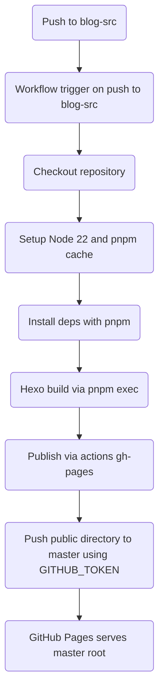

# 使用 GitHub Actions 自动部署 Hexo 到 master

本文档说明如何启用并使用仓库内置的工作流 `.github/workflows/hexo-deploy.yml`。

当你向源码分支 `blog-src` 推送时，工作流会：
- 安装 Node 22 与依赖（使用 pnpm 并启用缓存）。
- 执行 `hexo clean && hexo generate` 生成 `public/`。
- 将 `public/` 推送到 `master` 分支（作为页面分支）。

## 必需配置

- Actions 权限：仓库 Settings → Actions → General → Workflow permissions 选择 “Read and write permissions”。
- Pages 来源：Settings → Pages → Build and deployment
  - Source 选择 “Deploy from a branch”。
  - Branch 选择 `master`，Folder 选择 `/ (root)`。
- 分支约定：
  - 源码分支：`blog-src`（存放 Hexo 源码）。
  - 产物分支：`master`（首次部署时自动创建）。
- 依赖与锁文件：`package.json` 中包含 Hexo 与插件依赖，建议存在锁文件（package-lock.json / pnpm-lock.yaml / yarn.lock）。
- 站点地址：在 `/_config.yml` 设置
  - `url: https://<yourname>.github.io`
  - `root: /`

## 目录结构（关键项）

```
.
├─ source/              # 文章与静态资源（含 CNAME 会被复制）
├─ themes/              # 主题
├─ _config.yml          # Hexo 站点配置
├─ package.json         # 建议包含 hexo 及插件
└─ .github/workflows/hexo-deploy.yml
```

## 常用操作

- 新建文章并推送：
  ```bash
  hexo new post "my-post"
  # 编辑完成后
  git add -A && git commit -m "post: my-post" && git push
  ```
- 手动触发构建：在 GitHub 的 “Actions” 选择 “Build and Deploy Hexo to master”，点击 “Run workflow”。

## 可选/按需配置

- 自定义域名：把域名写入 `source/CNAME`（仅一行域名）。
- 主题为子模块：需要拉取子模块时，将 checkout 步骤改为：
  ```yaml
  - uses: actions/checkout@v4
    with:
      fetch-depth: 0
      submodules: recursive
  ```
- 使用 pnpm（已默认启用）：工作流已使用 `pnpm/action-setup@v4` 并在 `actions/setup-node@v4` 中设置 `cache: pnpm` 与 `cache-dependency-path: pnpm-lock.yaml`；安装命令为 `pnpm install --frozen-lockfile`。
- Node 版本：在工作流的 `actions/setup-node@v4` 中调整 `node-version`。

## 故障排查

- 工作流未触发：确认你推送的是 `blog-src` 分支，且仓库已允许 GitHub Actions 运行。
- 推送 `master` 失败：检查 Workflow permissions 是否为 “Read and write permissions”。
- 页面 404 或未更新：
  - Settings → Pages 是否选择了 `master / (root)`。
  - 确认构建日志中 `public/` 已生成，且 `peaceiris/actions-gh-pages` 步骤成功。
- CNAME 丢失：确保 `source/CNAME` 存在，Hexo 会复制到 `public/CNAME`。

## 认证与 GITHUB_TOKEN

结论：无需单独配置 GITHUB_TOKEN。

- GitHub 在每次工作流运行时自动注入一个仓库作用域的 GITHUB_TOKEN，本文工作流已使用它推送到 master。
- 前提：在仓库 Settings → Actions → General → Workflow permissions 选择 “Read and write permissions”。
- 工作流中已设置 `permissions: contents: write`，需与上面的仓库级权限配合以允许推送。
- 注意分支保护：若 master 开启了禁止直接推送的保护规则，请放宽或改用其它发布分支。
- 何时需要 PAT（可选）：跨仓库或跨组织发布、访问私有子模块、需要超出 `contents: write` 的权限，或需要让部署提交触发其他工作流时。

## 工作流逻辑图（Mermaid）



## 工作流文件位置与关键配置

- 路径：`.github/workflows/hexo-deploy.yml`
- 触发分支：`on.push.branches: [blog-src]`
- 发布分支：`publish_branch: master`
- 发布目录：`publish_dir: ./public`

无需配置 Personal Access Token，本工作流使用内置 `GITHUB_TOKEN` 推送（配合上文写权限设置）。
