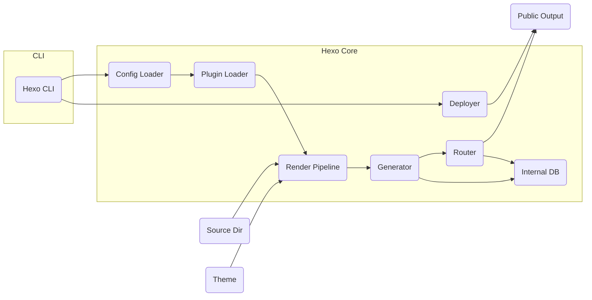
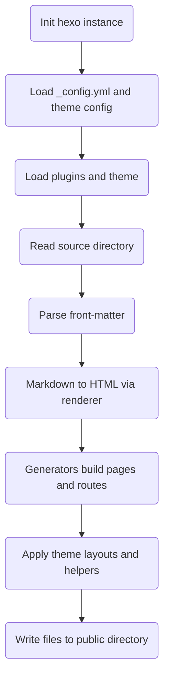
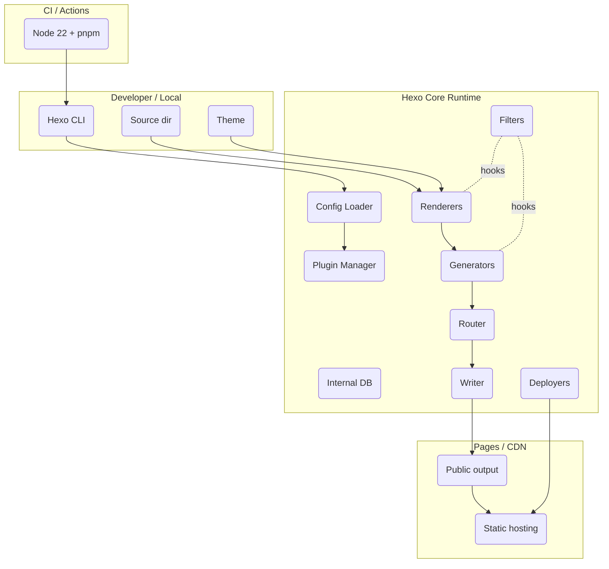
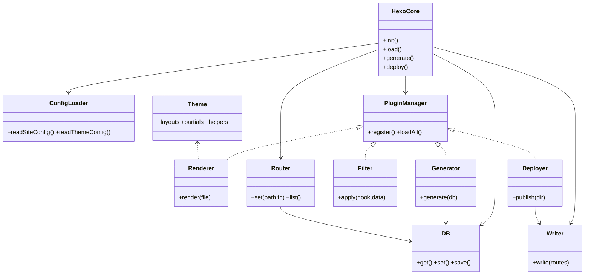
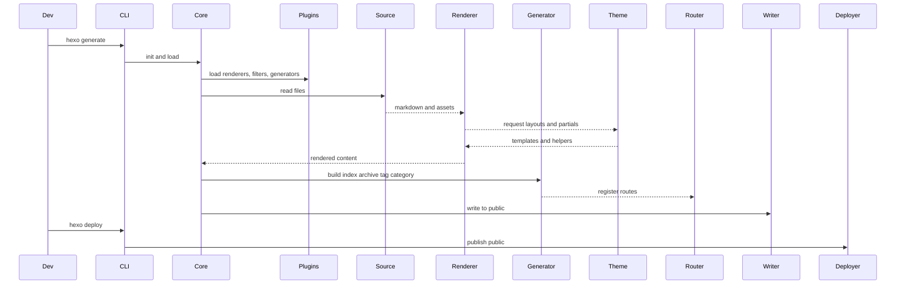
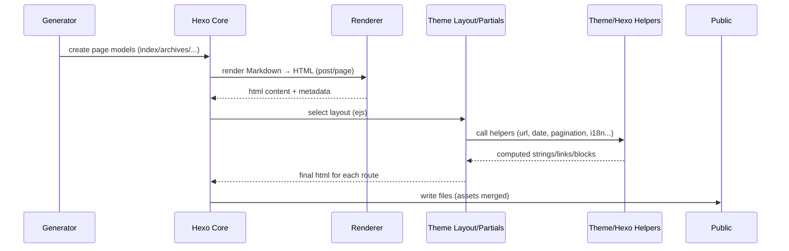

# Hexo 框架原理与架构设计

本文概述 Hexo 的核心组成、工作机制与关键执行流程，并配套 Mermaid 图示说明。

## 核心概念
- 核心与 CLI：`hexo` 命令行驱动 `hexo` 核心（初始化、加载、调度）。
- 源文件：位于 `source/` 的 Markdown、资源文件与页面目录。
- 主题：位于 `themes/<name>/`，包含布局（layout）、局部（partials）、样式与脚本，提供渲染模板与前端资源。
- 插件体系：通过 NPM 包扩展，常见类型有渲染器（renderer）、生成器（generator）、过滤器（filter）、部署器（deployer）等。
- 数据与路由：Hexo 将元信息存入内存数据库（`hexo.database`），通过 `route` 构建输出映射，最后写入 `public/`。

## 组件关系（Mermaid）



说明
- CLI 解析命令后初始化核心，按阶段加载配置与插件，执行渲染、生成与部署。
- 渲染阶段读取 `source/` 与主题模板，经过渲染器与过滤器处理，产出路由与静态文件。
- 内部数据库存放站点、文章与路由等元数据；生成器与路由器均与其交互。

## 生成流程（Mermaid）



要点
- 渲染器（如 `hexo-renderer-marked` 或 `hexo-renderer-pandoc`）负责把 Markdown/模板转为 HTML。
- 生成器（如 `hexo-generator-index`, `hexo-generator-archive`）根据数据生成索引、归档、分类、标签等页面与路由。
- 主题 helper/partial 参与布局合成，最终写入 `public/`。

## 常见命令与对应阶段
- `hexo clean`：清理缓存与 `public/`。
- `hexo generate` 或 `hexo g`：执行上文生成流程，产出 `public/`。
- `hexo server` 或 `hexo s`：启动本地服务，基于路由与文件提供预览。
- `hexo deploy` 或 `hexo d`：调用部署器将 `public/` 推送到目标（如 Git、S3）。

## 插件扩展点
- 渲染器（renderer）：扩展源文件类型到 HTML（或其他）的转换逻辑。
- 过滤器（filter）：在数据读入、渲染前后、生成前后等生命周期节点对内容进行变换。
- 生成器（generator）：根据数据库中的文章与页面生成最终的 URL 路由与文件内容。
- 部署器（deployer）：将 `public/` 发布到目标平台。

## 组件清单（完整）

Hexo 提供统一的扩展 API：`hexo.extend.*`，典型组件与职责如下。

- `renderer` 渲染器
  - 将特定后缀的源文件渲染为目标格式（通常是 HTML 或 CSS/JS）。
  - 例：`hexo-renderer-marked`（Markdown→HTML）、`hexo-renderer-ejs`、`hexo-renderer-pug`、`hexo-renderer-less/sass`。
- `generator` 生成器
  - 基于数据库与配置生成页面与路由（首页、归档、分类、标签等）。
  - 例：`hexo-generator-index`、`hexo-generator-archive`、`hexo-generator-category`、`hexo-generator-tag`、`hexo-generator-feed/sitemap/searchdb`。
- `filter` 过滤器
  - 生命周期钩子，时机包含：`before_post_render`、`after_post_render`、`before_generate`、`after_generate`、`new_post_path`、`post_permalink`、`after_render:html` 等。
  - 用于注入、改写、清理或统计。
- `deployer` 部署器
  - 发布 `public/` 到目标（Git、S3、FTP、Rsync 等）。
  - 例：`hexo-deployer-git`、`hexo-deployer-rsync`、`hexo-deployer-s3`。
- `tag` 标签插件
  - 在 Markdown 中通过 `` 语法插入复杂组件（视频、图表等）。
  - 例：`hexo-tag-dplayer`、`hexo-tag-aplayer`、`hexo-tag-mermaid`。
- `helper` 帮助方法
  - 提供模板可调用的工具函数（主题的 EJS/Pug/Nunjucks 模板中使用）。
- `console` 自定义命令
  - 向 CLI 添加新命令（如迁移工具、批处理脚本）。
- `processor` 处理器
  - 在读取 `source/` 时按文件类型自定义解析流程（如数据文件、特殊资源）。
- `migrator` 迁移器
  - 从其他平台导入内容（如 WordPress）。
- `injector` 注入器
  - 往主题的指定插槽注入 CSS/JS（视主题实现而定）。

内建/核心依赖（了解即可）
- `warehouse`：内存数据库与持久层（生成阶段使用 `db.json` 缓存）。
- `hexo-fs`、`hexo-util`、`hexo-front-matter`、`hexo-log`、`hexo-i18n` 等：文件、工具、前言区、日志与多语言支持。
- `hexo-pagination`：分页工具，常被生成器使用。

## 生命周期与过滤器（简表）

- 内容阶段：`before_post_render` → 渲染器 → `after_post_render`
- 生成阶段：`before_generate` → 生成器/路由 → `after_generate`
- 渲染阶段后处理：`after_render:html|css|js`
- 其它：`new_post_path`（新文路径）、`post_permalink`（固定链接格式化）、`before_exit`

过滤器用法（示意，放置于 `scripts/`）：
```js
// scripts/after-render.js
hexo.extend.filter.register('after_render:html', function (str) {
  // 对生成的 HTML 做最后处理
  return str.replace(/foo/g, 'bar');
});
```

## 官方与常用生态包（按类别）

- 核心与基础
  - `hexo`、`hexo-cli`、`hexo-server`（本地预览服务）
  - 实用库：`hexo-util`、`hexo-fs`、`hexo-front-matter`、`warehouse`
- 渲染器（选其一或多种）
  - Markdown：`hexo-renderer-marked`、`hexo-renderer-markdown-it`
  - 模板：`hexo-renderer-ejs`、`hexo-renderer-pug`、`hexo-renderer-nunjucks`
  - 样式：`hexo-renderer-less`、`hexo-renderer-sass`
- 生成器
  - `hexo-generator-index`、`hexo-generator-archive`、`hexo-generator-category`、`hexo-generator-tag`
  - 站点索引/订阅/搜索：`hexo-generator-sitemap`、`hexo-generator-feed`、`hexo-generator-searchdb`
- 部署器
  - `hexo-deployer-git`、`hexo-deployer-rsync`、`hexo-deployer-s3`、`hexo-deployer-ftp`
- 优化与功能增强
  - 压缩与整洁：`hexo-neat`、`hexo-html-minifier`
  - 统计与字数：`hexo-wordcount`
  - 链接与 SEO：`hexo-abbrlink`、`hexo-autonofollow`
  - 资源处理：`hexo-asset-pipeline`
- 标签与嵌入
  - 媒体：`hexo-tag-dplayer`、`hexo-tag-aplayer`
  - 图表：`hexo-tag-mermaid`

注：选择渲染器需与主题模板语言匹配（如主题用 EJS，需安装 `hexo-renderer-ejs`；Markdown 请选择一种渲染器）。

## 与 Node 生态结合实践

- 包管理器与脚本
  - 使用 `pnpm`/`npm`/`yarn` 管理依赖；在 `package.json` 定义脚本：
    - `scripts.build`: `hexo clean && hexo generate`
    - `scripts.dev`: `hexo s`
    - `scripts.deploy`: `hexo d`
- CI/CD 最佳实践
  - 使用 `actions/setup-node` + 包缓存（如 `cache: pnpm`）；在推送到源码分支时自动构建并发布到页面分支。
  - 将 `public/` 作为唯一产物输出，不将其纳入源码版本控制。
- 插件开发与复用
  - 在 `scripts/` 目录下用 Node 编写扩展（filter/helper/console 等），或发布独立 NPM 包以复用。
  - TypeScript：通过 ts-node 或预编译流程也可编写插件，但保持输出为可执行的 JS。
- 模块与前端构建
  - 主题内部可选用 Vite/Webpack/Sass 等工具编译前端资源（与 Hexo 互补；Hexo 负责内容与页面生产）。
- 配置与分层
  - 站点配置：`_config.yml`
  - 主题配置：`themes/<name>/_config.yml`，或通过根目录 `/_config.<theme>.yml`（本项目为 `_config.fluid.yml`）覆盖；最终合并后由主题读取。
- 缓存与存储
  - `db.json` 缓存站点数据；`.deploy_git` 为 Git 部署目标的本地仓库缓存。

## 典型问题与定位思路

- 渲染异常/标签无法识别：检查对应渲染器或标签插件是否安装，版本是否匹配 Node 版本。
- 主题布局变量未生效：确认主题配置文件被正确加载（根部的 `<theme>.yml` 覆盖机制）与变量命名。
- 部署失败：核对 deployer 配置与凭据（本项目使用 `GITHUB_TOKEN` 写入 `master`）。

## 上帝视角（总体架构）



## 组件静态组成图（Class 视图）



## 动态视角协作图（Sequence）



## Hexo × 主题 协作机制（重点）

协作总览
- 配置合并：Hexo 先加载站点配置 `_config.yml`，再加载主题默认配置 `themes/<name>/_config.yml`，最后用根目录的主题覆写文件（如本项目的 `_config.fluid.yml`）进行覆盖，形成渲染期可用的 `theme` 与 `config` 两套配置对象。
- 模板选择：生成器为不同页面类型指定 `layout`（如 `index`/`post`/`page`/`archive`/`category`/`tag`）。Hexo 将渲染后的内容注入到对应主题布局（`themes/<name>/layout/*.ejs|pug|njk`）中。
- 局部与助手：布局通过 `partials` 与 `helpers` 组织成可复用片段（导航、侧栏、页脚等）。主题和插件可注册 `helper` 以在模板中复用逻辑。
- 资源与静态前缀：主题的 `source/` 与站点的 `source/` 均会被拷贝/编译到 `public/`；主题可用 `static_prefix` 将第三方资源（CSS/JS）指向 CDN，或走本地相对路径。
- 自定义注入：主题通常提供注入点（如 Fluid 的 `inject_point()`）和配置项（`custom_css`/`custom_js`）以便站点在不改主题源码的情况下扩展前端资源。

协作时序（主题参与渲染）


与本项目（Fluid 主题）对应
- 配置合并与覆写
  - 站点：`_config.yml`
  - 主题默认：`themes/fluid/_config.yml`
  - 主题覆写：`_config.fluid.yml`（本项目主要调整字体、配色、代码高亮、链接等）
- 模板与注入点
  - 布局入口：`themes/fluid/layout/layout.ejs`
  - 注入点：`inject_point('bodyBegin'|'header'|'footer'|'bodyEnd'|...)` 供主题/插件/自定义脚本挂载内容
  - 自定义样式/脚本：`_config.fluid.yml.custom_css` 与 `custom_js`，由 `themes/fluid/layout/_partials/css.ejs` 等 partial 统一引入
- 渲染器与样式链路
  - Markdown：`hexo-renderer-marked`
  - 模板：`hexo-renderer-ejs`
  - 样式：`hexo-renderer-stylus` 与（可选）`hexo-renderer-sass`，编译 `themes/fluid/source/css` 与站点 `source/css`
- 静态资源与 CDN
  - 主题 `static_prefix` 支持覆盖第三方库版本与来源（如 jQuery/Bootstrap/Prism 等）
  - 站点层面本项目新增 `source/css/lxgw-wenkai.css`，并在 `_config.fluid.yml.font.font_family` 指向 “LXGW WenKai”

协作对照表（关键协作点）

| 协作点 | Hexo 职责 | 主题（Fluid）职责 | 本项目配置 |
|---|---|---|---|
| 配置合并 | 读取并合并站点与主题配置 | 暴露可配置项并提供默认值 | `_config.yml` + `_config.fluid.yml` |
| 页面生成 | 生成器产出页面模型与路由 | 提供对应布局与局部 | `hexo-generator-*` + `themes/fluid/layout/*.ejs` |
| 内容渲染 | 调用渲染器处理 Markdown/模板 | 布局中调用 helper 组织页面 | `hexo-renderer-marked`/`ejs` |
| 资源构建 | 拷贝/编译 `source/` 至 `public/` | 定义静态前缀与样式变量 | `themes/fluid/source/` + `static_prefix` |
| 自定义注入 | 提供 filter/asset 注入阶段 | 暴露 `inject_point` 与 `custom_*` | `_config.fluid.yml.custom_css`/`custom_js` |

## Hexo 生态表格（按类别）

| 类别 | 代表包 | 作用 | 备注 |
|---|---|---|---|
| 核心 | hexo, hexo-cli, hexo-server | 提供 CLI、核心运行时与本地预览服务 | server 仅用于本地预览 |
| 实用库 | hexo-util, hexo-fs, hexo-front-matter, warehouse | 工具、文件、前言区与内存数据库 | 内部被核心与插件使用 |
| 渲染器 | hexo-renderer-marked, hexo-renderer-markdown-it, hexo-renderer-ejs, hexo-renderer-pug, hexo-renderer-nunjucks, hexo-renderer-less, hexo-renderer-sass | 将 Markdown/模板/样式编译为 HTML/CSS | 与主题模板语言匹配 |
| 生成器 | hexo-generator-index, hexo-generator-archive, hexo-generator-category, hexo-generator-tag, hexo-generator-sitemap, hexo-generator-feed, hexo-generator-searchdb | 生成首页、归档、分类、标签、站点地图、订阅、搜索数据 | 组合启用 |
| 部署器 | hexo-deployer-git, hexo-deployer-rsync, hexo-deployer-s3, hexo-deployer-ftp | 发布 public 到目标平台 | 本项目使用 git 到 master |
| 优化 | hexo-neat, hexo-html-minifier, hexo-wordcount | 压缩、整洁、字数统计 | 构建后处理常用 |
| SEO/链接 | hexo-abbrlink, hexo-autonofollow | 固定链接、外链属性 | 需与路由策略协调 |
| 资源管线 | hexo-asset-pipeline | 合并压缩资源 | 与主题构建工具互补 |
| 标签 | hexo-tag-dplayer, hexo-tag-aplayer, hexo-tag-mermaid | 在 Markdown 中插入媒体与图表 | 与前端脚本或 CDN 协同 |
| 搜索 | hexo-generator-searchdb | 站内搜索数据 | 配合前端搜索脚本 |
| 迁移 | hexo-migrator-* | 从其他平台导入内容 | 一次性使用为主 |
