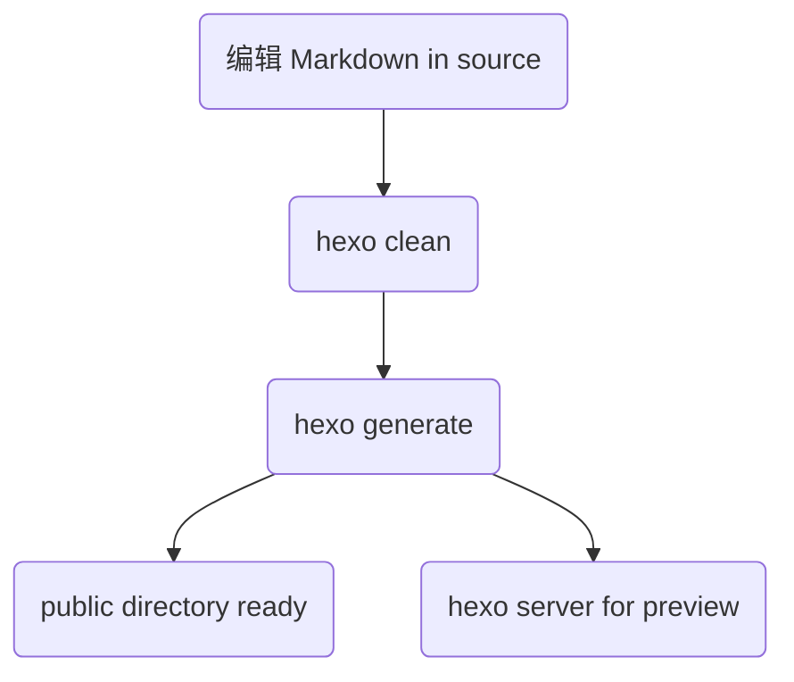
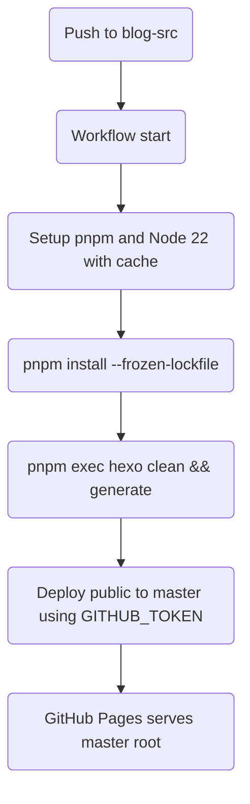
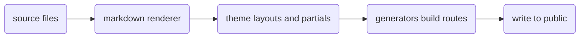

# 项目目录结构说明与执行流/逻辑链

本文说明本仓库（Hexo 站点源码）的目录结构，以及与 Hexo 标准结构的对应关系；并给出本地与 CI 的执行流与逻辑链（含 Mermaid 图）。

## 目录结构（关键项）

```
.
├─ source/                # 文章与静态资源（含 page、img、CNAME 等）
├─ themes/                # 主题目录（本项目使用 Fluid）
├─ scaffolds/             # 新建文章/页面的模板
├─ scripts/               # 自定义脚本与注入点（可选）
├─ public/                # 生成结果目录（hexo g 后产生，不需手动编辑）
├─ _config.yml            # 站点主配置
├─ _config.fluid.yml      # 主题配置（当前主题为 fluid）
├─ package.json           # 依赖与脚本（建议包含 hexo 及插件）
├─ pnpm-lock.yaml         # 包管理器锁定文件
└─ .github/workflows/hexo-deploy.yml  # 构建与部署工作流
```

与 Hexo 的关系
- 结构遵循 Hexo 约定：`source/` 作为输入，`public/` 作为输出，`themes/` 提供布局与样式，配置文件在仓库根部。
- 主题配置独立于站点配置：本仓库在 `_config.fluid.yml` 中覆盖/扩展主题相关项（如字体、颜色、布局等）。

## 本地执行流（Mermaid）



说明
- 写作在 `source/_posts/` 或 `source/` 下新建页面；`hexo new post "title"` 会基于 `scaffolds/` 生成初始 front‑matter。
- 预览使用 `hexo s`，默认监听更改并增量构建。

## CI 执行流与逻辑链（Mermaid）



关键说明
- 触发分支：`blog-src`；发布分支：`master`。
- 权限：Actions 需开启 “Read and write permissions”，工作流设置 `permissions: contents: write`。
- 字体：通过 `source/css/lxgw-wenkai.css` 引入「霞鹜文楷」，并在 `_config.fluid.yml` 的 `font.font_family` 指定字体族。

## 生成阶段的内部逻辑（简版）



对照本项目
- 渲染器与生成器由 `package.json` 中的依赖与主题配置决定；Fluid 主题在布局与局部模板中注入样式与脚本。
- 自定义样式通过 `_config.fluid.yml -> custom_css` 列表注入（本项目已添加 `/css/lxgw-wenkai.css`）。

